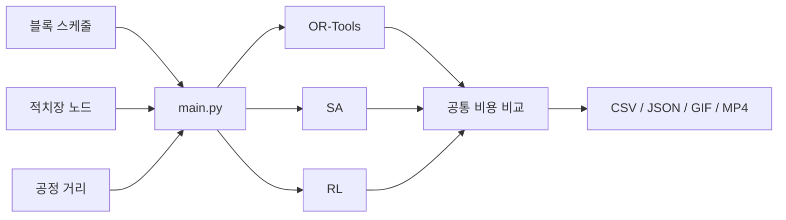

# SSI Digital Yard

선박 블록의 공장 간 이동거리, 적치장 내부 취급 위험, 일별 혼잡도를 함께
고려하는 디지털 트윈 최적화 실험 프로젝트입니다. 동일한 입력과 비용식으로
OR, Simulated Annealing(SA), Reinforcement Learning(RL)을 비교합니다.

## 구조



| 경로 | 역할 |
| --- | --- |
| [`main.py`](main.py) | 실험 공통 진입점 |
| [`milp-solver/`](milp-solver/) | OR-Tools MIP 솔버 |
| [`grid_placement/`](grid_placement/) | BFS first-fit 및 DFS 방해 블록 탐색 |
| [`experiment/`](experiment/) | 공통 비용, 결과 비교 및 시각화 |
| [`data/`](data/) | 스케줄, 노드 및 거리 입력 데이터 |

## 수학 모델

MIP 표기법, 목적함수와 제약식은 별도 문서에 정리되어 있습니다.

**[OR-Tools MIP Mathematical Formulation](milp-solver/FORMULATION.md)**

구현은 [`StockyardModelBuilder`](milp-solver/constraints.py#L134)에서 확인할 수
있습니다.

## 실행

Python 3.9 이상 3.13 이하 환경을 권장합니다.

```bash
python -m pip install -r requirements.txt
```

OR-Tools 실행:

```bash
python main.py \
  --methods or \
  --limit 500 \
  --time-limit-seconds 30
```

비교표와 GIF, MP4 생성:

```bash
python main.py \
  --methods all \
  --limit 2000 \
  --time-limit-seconds 60 \
  --visualize both
```

전체 30,000개 블록은 `--limit 0`으로 실행합니다.

```bash
python main.py --methods or --limit 0 --time-limit-seconds 300
```

결과는 `runs/<실행시각>/`에 저장됩니다.
